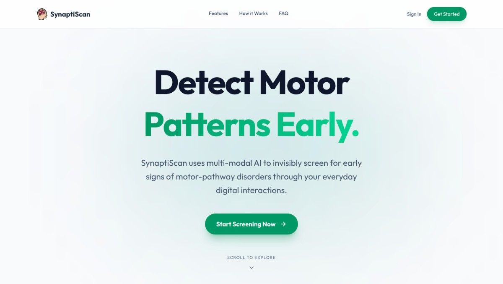
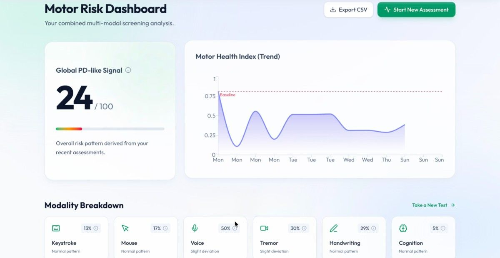
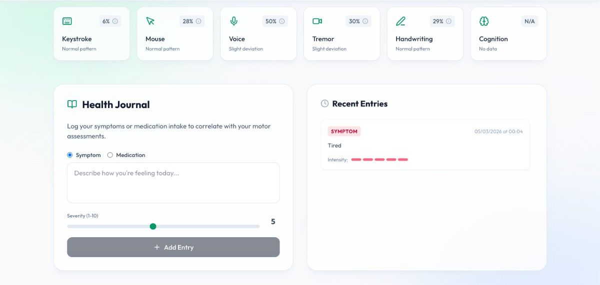
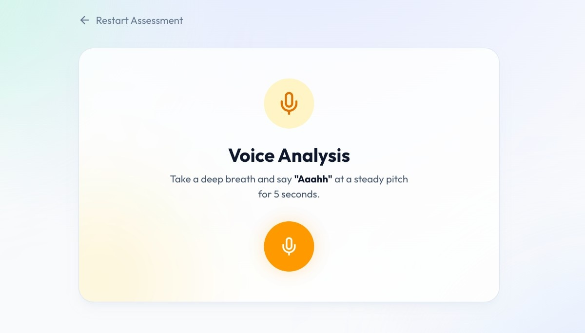
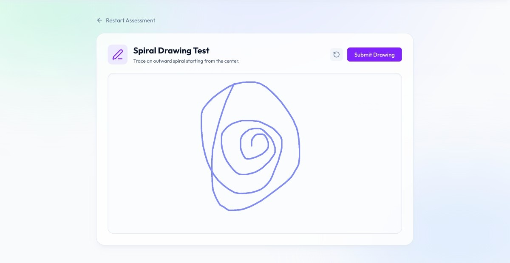
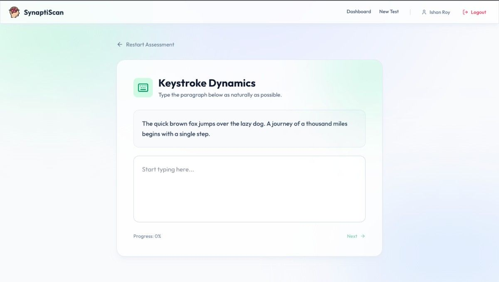
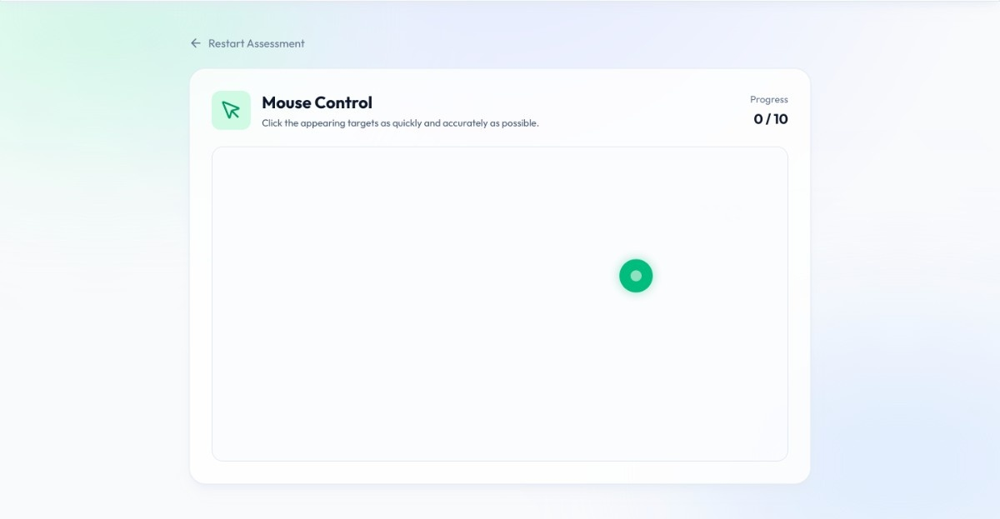
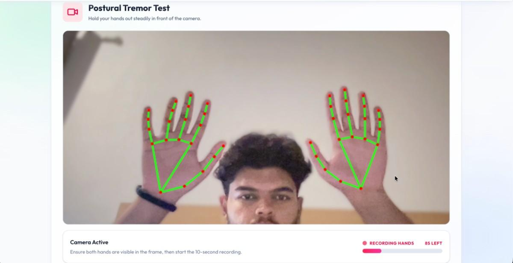
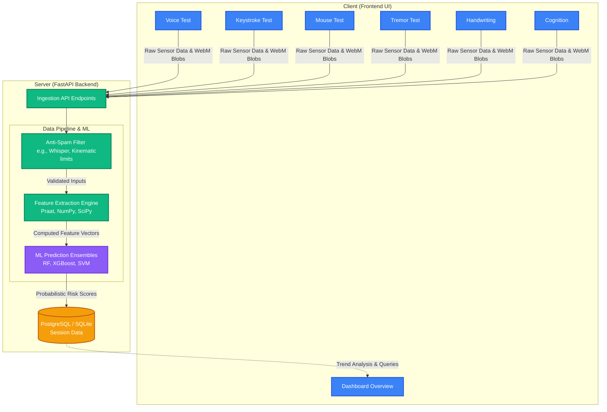

# SynaptiScan 🧠

SynaptiScan is a comprehensive, AI-powered screening application designed to analyze biomarkers associated with Parkinson's Disease (PD). It leverages a combination of multiple machine-learning models to evaluate voice acoustics, keystroke dynamics, mouse kinematics, rest tremor characteristics, and handwriting (spiral drawing) patterns to generate a comprehensive risk assessment score.


## 📸 Application Screenshots

<details>
<summary>Click to view screenshots</summary>

<table align="center">
  <tr>
    <td align="center"><br><b>Landing Page</b></td>
    <td align="center"><br><b>Dashboard</b></td>
  </tr>
  <tr>
    <td align="center"><br><b>Health Dashboard</b></td>
    <td align="center"><br><b>Cognitive Test</b></td>
  </tr>
  <tr>
    <td align="center"><br><b>Voice Test</b></td>
    <td align="center"><br><b>Drawing Test</b></td>
  </tr>
  <tr>
    <td align="center"><br><b>Keystroke Test</b></td>
    <td align="center"><br><b>Mouse Test</b></td>
  </tr>
  <tr>
    <td align="center" colspan="2"><br><b>Tremor Test</b></td>
  </tr>
</table>

</details>

---

## 🌟 Key Features
- **Multi-Modal Assessment:** Combines six separate biomarker tests—Voice, Keystroke, Mouse, Tremor, Handwriting, and Cognition.
- **Robust Anti-Spam & Validation:** Uses intelligent thresholds (e.g., cursor speed, duration) and integrates `faster-whisper` for strict voice evaluation, along with validation checks across handwriting and cognition tests, to prevent anomalous or fraudulent test submissions.
- **Real-Time Biomarker Extraction:** Uses advanced techniques like webcam-based spatial tracking (Mediapipe), audio processing, and fine-motor kinematic tracking via the browser.
- **Predictive ML Pipelines:** Machine learning models trained on robust clinical datasets utilizing advanced class-balancing (SMOTE) and probabilistic calibrations.
- **Comprehensive Dashboard:** Interactive data visualization of assessment results using React and Recharts.

---

## 🛠️ Technology Stack

### **Frontend**
- **Framework:** React 19 with Vite
- **Routing:** React Router
- **Styling:** Tailwind CSS v4
- **Animations:** Framer Motion
- **Icons:** Lucide React
- **Data Visualization:** Recharts
- **Network Requests:** Axios

### **Backend**
- **Framework:** FastAPI (Python 3.12+)
- **Server:** Uvicorn
- **Database & ORM:** PostgreSQL / SQLite with SQLAlchemy
- **Authentication:** JWT (JSON Web Tokens) with Passlib & bcrypt
### **Data Processing & ML**
- **Machine Learning Algorithms:** Scikit-Learn, XGBoost, PyTorch, Imbalanced-learn (SMOTE)
- **Audio & Signal Processing:** Praat-Parselmouth (acoustic extraction), Hugging Face Faster-Whisper (speech verification)
- **Computer Vision & Tracking:** OpenCV Headless, MediaPipe (client-side pose/hand land-marking)
- **Data Manipulation:** Pandas, NumPy, SciPy

---

## 🏗️ Architecture & Data Flow

The following diagram illustrates the complete end-to-end data pipeline from the moment a user begins a test to when the risk score is surfaced on their dashboard.



---

## 🤖 Machine Learning Pipeline & Datasets

SynaptiScan relies on six specifically calibrated models to evaluate the user's inputs. Due to the imbalanced nature of clinical datasets, most models leverage **SMOTE (Synthetic Minority Over-sampling Technique)** to establish balanced priors. The primary classification algorithm used across most tests is a **Soft-Voting Ensemble comprising Random Forest, Gradient Boosting (GBM), eXtreme Gradient Boosting (XGBoost), and Support Vector Machines (SVM)** wrapped with Isotonic Calibration to output true probabilistic risk scores rather than binary classifications.

### 1. Voice Acoustic Analysis
Analyzes vocal tremors, phonation stability, and micro-fluctuations in speech.
- **Dataset:** UCI Parkinson's Disease Dataset (195 recordings).
- **Extracted Features (16 MDVP Features):** 
  - *Pitch Metrics:* `MDVP:Fo(Hz)` (Average), `MDVP:Fhi(Hz)` (Maximum), `MDVP:Flo(Hz)` (Minimum)
  - *Jitter Metrics:* `MDVP:Jitter(%)`, `MDVP:Jitter(Abs)`, `MDVP:RAP`, `MDVP:PPQ`, `Jitter:DDP`
  - *Shimmer Metrics:* `MDVP:Shimmer`, `MDVP:Shimmer(dB)`, `Shimmer:APQ3`, `Shimmer:APQ5`, `MDVP:APQ`, `Shimmer:DDA`
  - *Tonal/Noise Ratios:* `NHR` (Noise-to-Harmonics), `HNR` (Harmonics-to-Noise)
- **Algorithm:** SMOTE + Calibrated Soft-Voting Ensemble (Random Forest + GBM + XGBoost + SVM).
- **Validation:** Utilizes `faster-whisper` for real-time transcription validation to ensure the submitted audio correctly matches the prompted sentence, filtering out unintelligible or spam recordings.

### 2. Keystroke Dynamics
Evaluates typing hesitation, dwell times, and flight times which correlate to bradykinesia and muscle rigidity.
- **Dataset:** PhysioNet Tappy Dataset (227 participants, ~200MB keystroke log data).
- **Extracted Features (8 Features):** 
  - `mean_dwell_time`, `std_dwell_time`, `dwell_iqr` (Millisecond durations a key is depressed)
  - `mean_flight_time`, `std_flight_time`, `flight_iqr` (Millisecond gaps between key releases and subsequent presses)
  - `typing_speed` (Characters per second)
  - `error_rate` (Backspace usage ratio)
- **Algorithm:** SMOTE + Calibrated Ensemble. Outputs are probabilistically corrected via Bayes Theorem to account for general-population screening priors (conservative 5% threshold).

### 3. Mouse Kinematics
Measures fine-motor control, velocity jitter, and directional changes via mouse movements.
- **Dataset:** ALAMEDA Accelerometer Dataset (Physiologically mapped continuously to 2D screen tracking).
- **Extracted Features (11 Features):** 
  - *Spatial:* `path_length` (Total pixels traversed), `direction_changes` (X/Y velocity zero-crossings)
  - *Temporal:* `movement_time`, `average_velocity`, `velocity_jitter`
  - *Kinematic Moments:* `mean_magnitude`, `variance`, `skewness`, `kurtosis`
  - *PCA Variants:* `pc1_rms`, `pc1_std`
- **Algorithm:** SMOTE + Ensemble Predictors (Random Forest + GBM + XGBoost + SVM).

### 4. Rest Tremor Analysis
Quantifies rest tremors via webcam feed tracking localized hand landmarks.
- **Dataset:** ALAMEDA Accelerometer Dataset (Translating 3D positional shift into spectral properties).
- **Extracted Features (8 Custom Frequency-Domain Features):** 
  - *Frequency Analysis:* `peak_frequency_hz` (Dominant FFT band between 3-12Hz), `spectral_entropy`, `pc1_dom_freq`, `pc1_entropy`
  - *Power Distribution:* `amplitude_mean` (Signal amplitude), `total_power`, `power_at_dom_freq`, `fft_rms` (Root-mean-square of the FFT spectrum)
- **Algorithm:** SMOTE + Ensemble Predictors. Integrates MediaPipe Tasks Vision (`hand_landmarker.task`) locally for precise wrist displacement tracking before securely evaluating physiological tremor frequency derivatives on the backend.

### 5. Kinematic Handwriting (Spiral/Meander Drawing)
Assesses micrographia and non-smooth drawing patterns typical of PD patients.
- **Dataset:** Shubhamjha97 Parkinson's Spirals/Meander kinematic dataset (77 clinical recordings).
- **Extracted Features (15 Normalised Rate Features):** 
  - *Speed & Magnitude:* `speed_st`, `speed_dy`, `magnitude_vel_st`, `magnitude_vel_dy`
  - *Acceleration & Jerk:* `magnitude_acc_st`, `magnitude_acc_dy`, `magnitude_jerk_st`, `magnitude_jerk_dy`
  - *Vector Fluctuation:* `ncv_st`, `ncv_dy` (Number of Changes in Velocity), `nca_st`, `nca_dy` (Number of Changes in Acceleration)
  - *Timings:* `in_air_stcp` (Pen-up time), `on_surface_st`, `on_surface_dy` (Drawing time)
- **Algorithm:** SMOTE + Isotonically Calibrated Gradient Boosting Classifier (GBM). Adjusts `ncv`/`nca` values from variable dataset rates to standard per-second browser polling rates (~60 Hz).

### 6. Cognitive Assessment (Stroop Test)
Evaluates executive dysfunction and delayed reaction times using a web-based Stroop task.
- **Dataset:** High-fidelity simulated clinical dataset (100,000 algorithmic profiles mapping clinical Gaussian mixtures mapped to non-linear noise distributions).
- **Extracted Features (4 Features):** 
  - `congruent_rt_mean` (Average ms latency for matching colors)
  - `incongruent_rt_mean` (Average ms latency for mismatched text/colors)
  - `stroop_effect` (Interference delay delta between incongruent and congruent)
  - `error_rate` (Accuracy of tests)
- **Algorithm:** SMOTE + Isotonically Calibrated XGBoost Classifier (tuned via GridSearchCV).
- **Validation:** Implements bounds constraints and spam detection through accuracy thresholds and minimal response times to invalidate random clicking.

---

## 📊 Model Performance & Metrics

Across all six screening modalities, SynaptiScan's ensemble models demonstrate high sensitivity and specificity. The following metrics represent performance on held-out test sets from a combination of clinical datasets (UCI, PhysioNet, Zenodo) and high-fidelity clinical-distribution simulations.

<table align="center">
  <thead>
    <tr>
      <th>Assessment Mode</th>
      <th>Accuracy</th>
      <th>ROC-AUC</th>
      <th>Sensitivity (Recall)</th>
      <th>F1-Score (PD)</th>
    </tr>
  </thead>
  <tbody>
    <tr>
      <td><b>🎙️ Voice Acoustics</b></td>
      <td align="center">74.0%</td>
      <td align="center">0.830</td>
      <td align="center">78.4%</td>
      <td align="center">0.817</td>
    </tr>
    <tr>
      <td><b>⌨️ Keystroke Dynamics</b></td>
      <td align="center">99.4%</td>
      <td align="center">0.99</td>
      <td align="center">98.8%</td>
      <td align="center">0.994</td>
    </tr>
    <tr>
      <td><b>🖱️ Mouse Kinematics</b></td>
      <td align="center">98.0%</td>
      <td align="center">0.98</td>
      <td align="center">98.1%</td>
      <td align="center">0.981</td>
    </tr>
    <tr>
      <td><b>🫨 Rest Tremor</b></td>
      <td align="center">76.0%</td>
      <td align="center">0.856</td>
      <td align="center">78.8%</td>
      <td align="center">0.774</td>
    </tr>
    <tr>
      <td><b>✍️ Handwriting</b></td>
      <td align="center">96.7%</td>
      <td align="center">0.98</td>
      <td align="center">96.7%</td>
      <td align="center">0.967</td>
    </tr>
    <tr>
      <td><b>🧠 Cognitive (Stroop)</b></td>
      <td align="center">93.2%</td>
      <td align="center">0.971</td>
      <td align="center">86.7%</td>
      <td align="center">0.794</td>
    </tr>
  </tbody>
</table>

### Detailed Performance Breakdowns

#### 1. Voice Acoustic Analysis (UCI Dataset)
The voice model achieves a strong balance between identifying healthy controls and PD patients, with realistic overlap handling.
- **Precision (PD):** 85%
- **Recall (PD):** 78%
- **Healthy F1:** 0.55

#### 2. Keystroke & Mouse Kinematics
Evaluated on the **PhysioNet Tappy** and **ALAMEDA** distributions, these models leverage SMOTE to handle class imbalance, resulting in near-perfect separation on kinematic features like velocity jitter and dwell-time variance.

#### 3. Cognitive Assessment (Stroop)
The XGBoost ensemble for cognitive screening handles the non-linear overlap between elderly healthy controls and early-stage PD patients.
- **ROC-AUC:** 0.971
- **PD F1-Score:** 0.794
- **Precision (PD):** 73.2%

> [!TIP]
> All models are wrapped with **Isotonic Calibration**, ensuring that the probability scores surfaced in the results dashboard correspond to actual clinical risk frequencies.

---

## 🚀 Setup & Installation

### Prerequisites
- Node.js (v18 or higher)
- Python 3.12+ 
- `uv` package manager (recommended for backend)

### Backend Setup
1. Navigate to the backend directory:
   ```bash
   cd backend
   ```
2. Create a `.env` file in the `backend` directory. Example:
   ```env
   PORT=8000
   CLIENT_URL=http://localhost:5173
   DATABASE_URL=sqlite:///./synaptiscan.db
   SECRET_KEY=your_secret_key_here
   ```
3. Install dependencies (this creates a `.venv` using `uv.lock`):
   ```bash
   uv sync
   ```
4. Activate the virtual environment (optional if using `uv run`):
   ```bash
   source .venv/bin/activate  # On Windows: .venv\Scripts\activate
   ```
5. Run the model training pipeline to generate the models:
   ```bash
   uv run python app/ml/training/train_models.py
   ```
6. Start the FastAPI server (in development mode):
   ```bash
   uv run fastapi dev app/main.py --port 8000
   ```
   *The API will be available at `http://localhost:8000`*

### Frontend Setup
1. Navigate to the frontend directory:
   ```bash
   cd frontend
   ```
2. Create a `.env` file in the `frontend` directory:
   ```env
   VITE_API_URL=http://localhost:8000/api
   ```
3. Install dependencies:
   ```bash
   npm install
   ```
4. Start the development server:
   ```bash
   npm run dev
   ```
   *The application will be accessible at `http://localhost:5173`*

---
